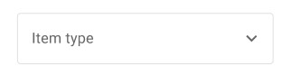
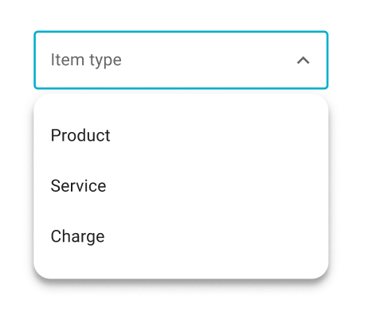
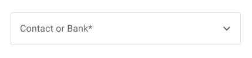
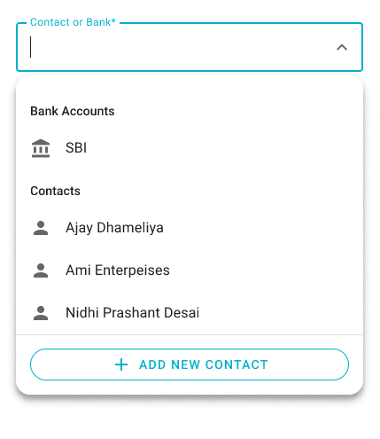

# `<dw-select>` [](https://www.npmjs.com/package/@dreamworld/dw-select)

A Select is an input widget with an associated dropdown that allows users to select a value from a list of possible values.

Two types of select component: [`default`](docs/non-searchable.md) (searchable=false), and [`searchable`](docs/searchable.md) (searchable=true). 

> Note: `dw-select` internally uses [`dw-list-item`](https://github.com/DreamworldSolutions/dw-list-item) to render items. use overide property `renderItem` to override items.

## Installation

```sh
npm install @dreamworld/dw-select
```

## Example usage

### Default

<br>


```html
<dw-select outlined items=${this.items} label="outlined"></dw-select>
```

### Searchable

<br>


```html
<dw-select outlined items=${this.items} label="outlined" searchable></dw-select>
```

## Behaviour
- Renders [`dw-select-trigger`](docs/select-trigger.md) and [`dw-select-dialog`](docs/select-dialog.md)
- Triggers internal validation on blur & select.
- Focus:
  - For searchable types, it shows a cursor. For non searchable type, doesn’t show cursor.
  - The dropdown opens when the user clicks the field using a pointing device.
- Clear Selection:
  - Searchable: remove all input text and it will clear the selection and dispatch a `clear-selection` event
  - Non-Searchable: there is no way to clear the selection for non-searchable. If required,  the integrator should provide an empty item for clear selection.

## API

### Extension Method
TODO

### Properties/Attributes

| Name                      | Type                          | Default            | Description
| ------------------------- | ----------------------------- | ------------------ | -----------
| `name`                    | `string`                      | `""`               | Sets the `name` attribute on the internal input. The name property should only be used for browser autofill as webcomponent form participation does not currently consider the `name` attribute.
| `value`                   | `object\|object[]`            | `null`             | Selected list item object. `object` in case of single selection; `object[]` in case of multiple selections.
| `originalValue`           | `object`                      | `null`             | Input property. __Note:__ When `originalValue` is specified (not `undefined`) & its value is different than this; then highlight is shown. (Comparison is done by reference)
| `outlined`                | `boolean`                     | `false`            | Whether or not to show the `outlined` variant.
| `label`                   | `string`                      | `""`               | Sets floating label value. __Note:__ The label will not float if the selected item has a false value property.
| `placeholder`             | `string`                      | `""`               | Sets disappearing input placeholder.
| `helper`                  | `string`                      | `""`               | Helper text to display below the input. Display default only when focused.
| `readOnly`                | `boolean`                     | `false`            | Whether or not to show the `readOnly` state.
| `required`                | `boolean`                     | `false`            | Displays error state if value is empty and input is blurred.
| `errorMessage`            | `string`                      | `undefined`        | Message to show in the error color when the textfield is invalid. 
| `requiredMessage`         | `string`                      | `undefined`        | Message to show in the error color when the `required`, and `_requiredErrorVisible` are true.
| `_requiredErrorVisible`   | `boolean`                     | `false`            | Whether or not to show the `required` error message.
| `validity`                | `ValidityState` (readonly)    | `{}`               | The [`ValidityState`](https://developer.mozilla.org/en-US/docs/Web/API/ValidityState) of the textfield.
| `autoValidate`            | `boolean`                     | `false`            | Reports validity on value change rather than only on blur.
| `disabled`                | `boolean`                     | `false`            | Whether or not to show the `disabled` variant.
| `searchable`              | `boolean`                     | `false`            | Whether or not to show the `searchable` variant.
| `vkb`                     | `boolean`                     | `false`            | `vkb` stands for Virtual KeyBoard. Whether the Device has Virtual KeyBoard.
| `groups`                  | [`Group[]`](#group)           | `null`             | List of groups.
| `groupSelector`           | `fn()`                        |                    | returns GroupName. Group selector provides a path of groupName in Items
| `groupExpression`         | `string`                      | `""`               | 
| `items`                   | `object[]`                    | `undefined`        | List of selectable items.
| `valueProvider`           | [`function`](#valueprovider-and-valueexpression)   | `undefined`        | Provides Value
| `valueExpression`         | [`string`](#valueprovider-and-valueexpression)     | `undefined`        | 
| `valueTextProvider`       | `function`                    | `undefined`        | returns String. Provides value that represents in list item
| `dialogWidth`             | `number`                      | `undefined`        | By default, the pop-over dialog is rendered in the width of the host element; And the fit dialog is rendered in a fixed-width specified by –dw-select-fit-dialog-width css property. <br>__But:__ when this is specified, both dialogs are shown in this width. <br>__Note:__ BottomSheet dialog is always in full width, so this doesn’t affect it.
| `renderItem`              | `HTMLTemplate`                | `undefined`        | Provides any Block element to represent list items. Should show its hover effect, and ripple on click. Highlight text based on `query`. Integrator listens to the ‘click’ event to know whether the selection is changed or not. <br>__Note:__ It must not be focusable.
| `renderGroupItem`         | `HTMLTemplate`                | `undefined`        | Provides any Block elements to represent group items. name property should be set to input name. Should show hover & ripple effects only if it’s collapsible. Integrator listens on ‘click’ event to toggle collapsed status.
| `valueEquator`            | `Function`                    | `(v1, v2) => v1 === v2` | Set this to configure custom logic to detect whether value is changed or not.
| `heading`                 | `String`                      | `""`               | Set it if you would like to show a heading on the bottom-sheet dialog. By default no heading.
| `showClose`               | `boolean`                     | `false`            | Shows an icon-button with a close icon, in the `top-right` corner on the bottom-sheet dailog.
| `selectedTrailingIcon`    | `string`                      | `undefined`        | Name of trailing Icon which availble in selected item.
| `searchPlaceholder`       | `string`                      | `""`               | Placeholder for fit dialog's search input
| `helperTextProvider`      | `fn()`                        |                    | Helper text provider. parameters: selected item. If this is provided show helper text using this function otherwise get from the `helper` property.
| `queryFilter`             | `function`                    | `[]`               | A function to customize search. function has two parameters. 1. item, 2. query. <br>__Note:__ returns always boolean
| `messages`                | [`Messages`](#messages)       | [`Messages`](#messages) | Messages of for No Records found, No Matching found, and loading state. It's showing in the dialog. Provide only the message key and value that you want to update. Select will handle it and update the message object.
| `errorInTooltip`          | `boolean`                     | `false`            | Show error meesage in error trailling icon hover tooltip. 
| `allowNewValue`           | `boolean`                     | `false`            | Whether new value is allowed or not. Can be used only when select is `searchable`
| `newValueProvider`        | `function`                    | (query) => query   | Value provider function. Used when `allowNewValue` is available, and `query` does not match with any options. Default it returns searched `query`. <br>__Note:__ Return value could be any except function. Including `Promise`.

### Group

#### Object

| Key           | Type                | Description
| ------------- | ------------------- | ---------------------------- 
| `name`        | `string`            | Name of the group.
| `title`       | `string`            | Titile of the group.
| `collapsible` | `boolean`           | Whether group is collapsible or not.
| `collapsed`   | `boolean`           | Whether group is collapsed or not.
| `icon`        | `string`            | name of Material icon. It's optional property.

#### Example

```object
{
  name: "BANKS",
  titile: "Banks",
  collapsible: true,
  collapsed: false
}
```

### ValueProvider and ValueExpression

- Provides a value based on the input received from either the `valueProvider` function or the `valueExpression`.
- If neither of these inputs are provided, the original item will be passed as the default value.
- If only one of these inputs is provided, the value will be computed based on that input.
- If both inputs are provided, the value will be computed from the `valueExpression`, and the `valueProvider` function will be ignored.

### Messages

#### Object

| key          | Type           | Default                      | Description
| ------------ | -------------- | ---------------------------- | ---------------
| `noRecords`  | `string`       | `No Records`                 | Show meesage on dialog when no records found.
| `noMatching` | `string`       | `No matching records found!` | Show when query does not match with any item.
| `loading`    | `string`       | `Loading...`                 | Show when items is `undefined`.

### Utils Functions

| Name                   | Arguments         | Retuens           | Description
| ---------------------- | ----------------- | ----------------- | -------------
| `queryFilterGenerator` | keys (string[])   | `Function`        | Query function Generator

### Events

| Event Name         | Target             | Detail             | Description
| ------------------ | ------------------ | ------------------ | -----------
| `selected`         | `dw-list-item`     |                    | Fired when the user changed selection. It’s dispatched even when the user selects the same value as the current.
| `invalid`          | `dw-select`        | validity           | Fired when checkValidity() call and value is does not pass validation, On blur, as checkValidity() is called internally.
| `valid`            | `dw-select`        | validity           | Fired when checkValidity() call and value pass validation, On blur, as checkValidity() is called internally.
| `clear-selection`  | `dw-select`        |                    | It is fired when the user explicitly clears the selection by removing all input text.

### Methods

| Name     | Description
| -------- | -------------
| `checkValidity() => boolean`   | Returns `true` if the textfield passes validity checks and fires an `valid`. Returns `false` and fires an [`invalid`](https://developer.mozilla.org/en-US/docs/Web/API/HTMLInputElement/invalid_event) event on the textfield otherwise.
| `reportValidity() => boolean`  | Runs checkValidity() method, and if it returns false, then it reports to the user that the input is invalid.
| `validate() => boolean`        | Call this to validate input. Returns false if value is invalid.

### CSS Custom Properties

| Name                                              | Default                   | Description
| ------------------------------------------------- | ------------------------- | -----------
| `--dw-select-updated-highlight-bg-color`          | `rgba(2, 175, 205, 0.04)` | Background Color of the trigger element when value is  Updated
| `--dw-select-item-selected-bg-color`              | `#6200ee`                 | Background color of the selected item
