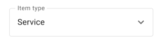
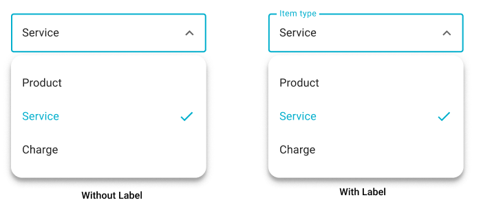
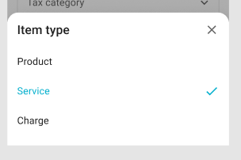

# Non Searchable

searchable = false

### Basic(filled)

```html
<dw-select items=${this.items} label="Basic" valueProvider=${(item) => item.value}></dw-select>

<script type="module">
  import '@dreamworld/dw-select';
</script>
```

### Outlined

<br>


```html
<dw-select outlined items=${this.items} label="outlined"></dw-select>
```

### Preselected

<br>


```html
<dw-select outlined items=${this.items} label="outlined" value=${items[0].value} valueProvider=${(item) => item.value}></dw-select>
```

### Mobile-mode

In mobile, select dialog is opened as bottom sheet dialog. If items is overflowed then dialog become fit-dialog.

<br>

```html
<dw-select outlined items=${this.items} vkb></dw-select>
```